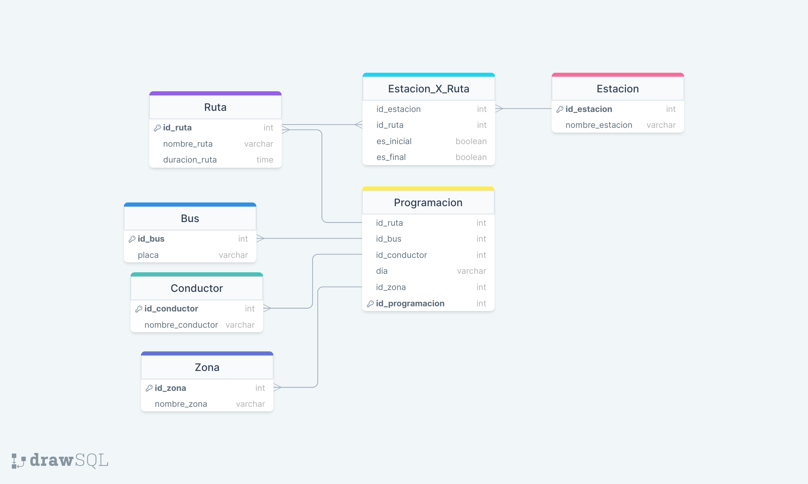
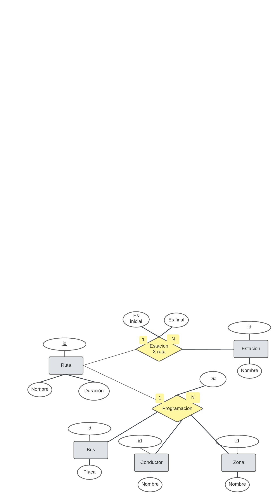
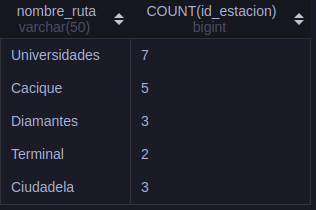
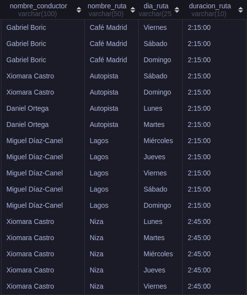
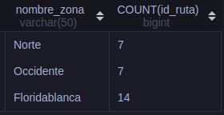

# Filtro Bases de datos MySQL
### Diego Alejandro Palacio Herrera R4
## Diagrama relacional

## Diagrama entidad relacion

## Creacion de la base de datos y sus respectivas tablas
~~~sql
CREATE DATABASE TMB;

USE TMB;

CREATE TABLE conductor(
    id_conductor INT PRIMARY KEY AUTO_INCREMENT,
    nombre_conductor VARCHAR(100)
);

CREATE TABLE bus(
    id_bus INT PRIMARY KEY AUTO_INCREMENT,
    placa VARCHAR(7)
);

CREATE TABLE ruta(
    id_ruta INT PRIMARY KEY AUTO_INCREMENT,
    nombre_ruta VARCHAR(50),
    duracion_ruta VARCHAR(10)
);

CREATE TABLE zona(
    id_zona INT PRIMARY KEY AUTO_INCREMENT,
    nombre_zona VARCHAR(50)
);

CREATE TABLE estacion(
    id_estacion INT PRIMARY KEY AUTO_INCREMENT,
    nombre_estacion VARCHAR(50)
);

CREATE TABLE estacion_x_ruta(
    id_estacion INT,
    id_ruta INT,
    es_inicial BOOLEAN,
    es_final BOOLEAN,
    FOREIGN KEY (id_estacion) REFERENCES estacion(id_estacion),
    FOREIGN KEY (id_ruta) REFERENCES ruta(id_ruta)
);

CREATE TABLE programacion(
    dia_ruta VARCHAR(25),
    id_ruta INT,
    id_bus INT,
    id_conductor INT,
    id_zona INT,
    FOREIGN KEY (id_ruta) REFERENCES ruta(id_ruta),
    FOREIGN KEY (id_bus) REFERENCES bus(id_bus),
    FOREIGN KEY (id_conductor) REFERENCES conductor(id_conductor),
    FOREIGN KEY (id_zona) REFERENCES zona(id_zona)
);
~~~
## Poblacion base de datos
~~~sql
INSERT INTO conductor(nombre_conductor) VALUES
('Andrés Manuel López Obrador'),
('Nicolás Maduro Moros'),
('Alberto Fernández'),
('Luiz Inácio Lula da Silva'),
('Gabriel Boric'),
('Miguel Díaz-Canel'),
('Daniel Ortega'),
('Gustavo Petro Urrego'),
('Luis Arce'),
('Xiomara Castro');

INSERT INTO bus(placa) VALUES
('XVH345'),
('XDL965'),
('XFG847'),
('XRJ452'),
('XDF459'),
('XET554'),
('XKL688'),
('XXL757');

INSERT INTO ruta(nombre_ruta, duracion_ruta) VALUES
('Universidades', '2:00:00'),
('Café Madrid', '2:15:00'),
('Cacique', '1:45:00'),
('Diamantes', '1:50:00'),
('Terminal', '2:00:00'),
('Prado', '1:30:00'),
('Cabecera', '1:30:00'),
('Ciudadela', '2:00:00'),
('Punta Estrella', '2:30:00'),
('Niza', '2:45:00'),
('Autopista', '2:15:00'),
('Lagos', '2:15:00'),
('Centro Florida', '2:30:00');

INSERT INTO zona(nombre_zona) VALUES 
("Norte"), 
("Sur"), 
("Oriente"), 
("Occidente"), 
("Floridablanca"), 
("Girón"), 
("Piedecuesta");

INSERT INTO estacion(nombre_estacion) VALUES 
("Colseguros"), 
("Clínica Chicamocha"), 
("Plaza Guarín"), 
("Mega Mall"), 
("UIS"), 
("UDI"), 
("Santo Tomás"), 
("Boulevard Santander"), 
("Búcaros"), 
("Rosita"), 
("Puerta del Sol"), 
("Cacique"), 
("Plaza Satélite"), 
("La Sirena"), 
("Provenza"), 
("Fontana"), 
("Gibraltar"), 
("Terminal"), 
("Mutis"), 
("Plaza Real");

INSERT INTO estacion_x_ruta(id_ruta, id_estacion) VALUES
(1,	1),
(1,	2),
(1,	3),
(1,	4),
(1,	5),
(1,	6),
(1,	7),
(3,	8),
(3,	9),
(3,	10),
(3,	11),
(3,	12),
(4,	13),
(4,	14),
(4,	15),
(5,	16),
(5,	17),
(8,	18),
(8,	19),
(8,	20);

INSERT INTO programacion(id_conductor, id_zona, id_ruta, id_bus, dia_ruta) VALUES
(5,	1,	1,	1, 	'Lunes'),
(5,	1,	1,	1, 	'Martes'),
(5,	1,	1,	3, 	'Miércoles'),
(5,	1,	1,	3, 	'Jueves'),
(5,	1,	2,	5, 	'Viernes'),
(5,	1,	2,	5, 	'Sábado'),
(5,	1,	2,	5, 	'Domingo'),
(3,	4,	4,	5, 	'Lunes'),
(3,	4,	4,	6, 	'Martes'),
(3,	4,	4,	1, 	'Miércoles'),
(3,	4,	5,	1, 	'Jueves'),
(3,	4,	5,	3, 	'Viernes'),
(3,	4,	5,	3, 	'Sábado'),
(3,	4,	5,	3, 	'Domingo'),
(10,	5,	10,	3, 	'Lunes'),
(10,	5,	10,	3, 	'Martes'),
(10,	5,	10,	5, 	'Miércoles'),
(10,	5,	10,	5, 	'Jueves'),
(10,	5,	10,	4, 	'Viernes'),
(10,	5,	11,	7, 	'Sábado'),
(10,	5,	11,	7, 	'Domingo'),
(7,	5,	11,	7, 	'Lunes'),
(7,	5,	11,	7, 	'Martes'),
(6,	5,	12,	7, 	'Miércoles'),
(6,	5,	12,	7, 	'Jueves'),
(6,	5,	12,	7, 	'Viernes'),
(6,	5,	12,	6, 	'Sábado'),
(6,	5,	12,	6, 	'Domingo');
~~~
## Consultas
## 1 Cantidad de Paradas por Ruta
~~~sql
SELECT nombre_ruta, COUNT(id_estacion) FROM estacion_x_ruta
INNER JOIN ruta ON estacion_x_ruta.id_ruta = ruta.id_ruta
GROUP BY estacion_x_ruta.id_ruta;
~~~

## 2 Nombre de las Paradas de la Ruta Universidades
~~~sql
SELECT nombre_estacion FROM estacion_x_ruta
INNER JOIN estacion ON estacion_x_ruta.id_estacion = estacion.id_estacion
WHERE estacion_x_ruta.id_ruta = 1;
~~~

## 3 Nombres de las Rutas No Programadas
~~~sql
SELECT nombre_ruta FROM ruta
LEFT JOIN programacion ON ruta.id_ruta = programacion.id_ruta
WHERE programacion.dia_ruta IS NULL;
~~~

## 4 Rutas Programadas sin Conductor Asignado
~~~sql
SELECT nombre_ruta FROM ruta
LEFT JOIN programacion ON ruta.id_ruta = programacion.id_ruta
WHERE programacion.id_conductor IS NULL;
~~~

## 5 Conductores No Asignados a la Programación
~~~sql
SELECT nombre_conductor FROM conductor
LEFT JOIN programacion ON conductor.id_conductor = programacion.id_conductor
WHERE programacion.dia_ruta IS NULL;
~~~

## 6 Buses No asignados a la Programación
~~~sql
SELECT placa FROM bus
LEFT JOIN programacion ON bus.id_bus = programacion.id_bus
WHERE programacion.dia_ruta IS NULL;
~~~

## 7 Zonas NO Programadas
~~~sql
SELECT nombre_zona FROM zona
LEFT JOIN programacion ON zona.id_zona = programacion.id_zona
WHERE programacion.dia_ruta IS NULL;
~~~

## 8 Programación asignada a cada conductor (Conductor, Ruta y Día)
~~~sql
SELECT nombre_conductor, nombre_ruta, dia_ruta FROM programacion
INNER JOIN ruta ON programacion.id_ruta = ruta.id_ruta
INNER JOIN conductor ON programacion.id_conductor = conductor.id_conductor;
~~~

## 9 Programación asignada a conductores que hacen rutas de más de dos horas
~~~sql
SELECT nombre_conductor, nombre_ruta, dia_ruta, duracion_ruta FROM programacion
INNER JOIN ruta ON programacion.id_ruta = ruta.id_ruta
INNER JOIN conductor ON programacion.id_conductor = conductor.id_conductor
WHERE ruta.duracion_ruta = '2:15:00' OR ruta.duracion_ruta = '2:30:00' OR ruta.duracion_ruta = '2:45:00'
ORDER BY ruta.duracion_ruta;
~~~

## 10 Nombres de Zonas y cantidad de rutas que tienen programadas (Contar)
~~~sql
SELECT nombre_zona, COUNT(id_ruta) FROM programacion
INNER JOIN zona ON programacion.id_zona = zona.id_zona
GROUP BY zona.nombre_zona;
~~~

### FIN