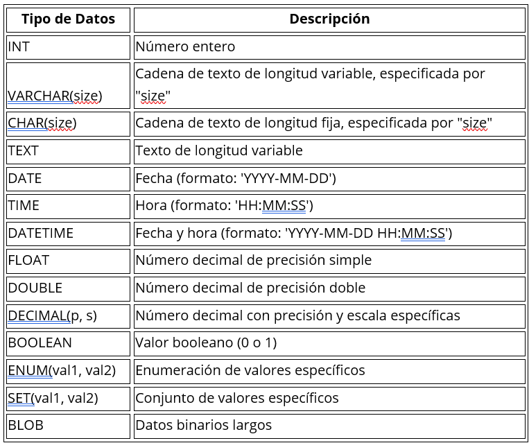

### Componentes principales del SQL
DDL (Data Definition Language Esta parte se utiliza para definir y administrar la
estructura de la base de datos

#### CREATE: Se utiliza para crear objetos de base de datos, como tablas, vistas, índices, etc.
#### ALTER: Se utiliza para modificar la estructura de los objetos existentes en la base de datos.
#### DROP: Se utiliza para eliminar objetos de la base de datos.
DML (Data Manipulation Language Esta parte se utiliza para manipular y gestionar los datos dentro de la base de datos.
#### SELECT: Se utiliza para recuperar datos de una o más tablas.
#### INSERT: Se utiliza para insertar nuevos registros en una tabla.
#### UPDATE: Se utiliza para modificar los datos existentes en una tabla.
#### DELETE: Se utiliza para eliminar registros de una tabla.
DQL (Data
Query Language Esta parte se utiliza específicamente para consultar y
recuperar datos de la base de datos. El comando SELECT es la instrucción DQL más
común utilizada para este propósito.
DCL (Data Control
Language Esta parte se utiliza para administrar los permisos
y la seguridad en la base de datos.
#### GRANT: Se utiliza para otorgar permisos a los usuarios para acceder a la base
de datos o a objetos específicos dentro de ella.
#### REVOKE: Se utiliza para revocar los permisos previamente otorgados a los
usuarios.
Estas son las partes principales de SQL que se utilizan para definir,
manipular, consultar y controlar los datos en una base de datos.

## Crear base de datos

~~~sql
CREATE DATABASE
nombre_de_la_base_de_datos
CREATE DATABASE IF NOT EXISTS
mundo
~~~

## Borrar base de datos

~~~sql
DROP DATABASE
nombre_de_la_base_de_datos
DROP DATABASE IF EXISTS
nombre_de_la_base_de_datos
~~~

## Crear tablas
~~~sql
CREATE TABLE IF NOT EXISTS nombre (
    camp1 INT PRIMARY KEY AUTO_INCREMENT,
    camp2 VARCHAR(255) NOT NULL,
    camp3 DATE
);
~~~
## Borrar tabla
~~~sql
DROP TABLE nombre_de_la_tabla;
~~~
## Definir llaves despues de crear la tabla
~~~sql
ALTER TABLE nombre_de_la_tabla
ADD PRIMARY KEY (columna1);
~~~
## Llave foranea
~~~sql

~~~sql
FOREIGN KEY PersonID REFERENCES Persons( PersonID);

ALTER TABLE Orders
ADD FOREIGN KEY PersonID REFERENCES Persons( PersonID);

ALTER TABLE Orders
DROP FOREIGN KEY FK_PersonOrder
~~~
