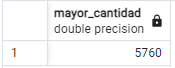
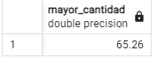
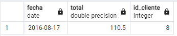

## Consultas SQL

Este archivo contiene una serie de consultas SQL diseñadas para trabajar con una tabla de pedidos, clientes y comerciales. Cada consulta está dividida en diferentes categorías para facilitar su comprensión y aplicación.

### 1 Consultas sobre una tabla

1. **Listado de pedidos:** Devuelve un listado con todos los pedidos ordenados por fecha de realización, mostrando los más recientes primero.

    ```sql
    SELECT * FROM pedido
    ORDER BY fecha DESC;
    ```

    

2. **Datos de los dos pedidos de mayor valor:** Devuelve todos los datos de los dos pedidos de mayor valor.

    ```sql
    SELECT * FROM pedido
    ORDER BY total DESC
    LIMIT 2;
    ```

    

3. **Listado de identificadores de clientes que han realizado algún pedido:** Devuelve un listado con los identificadores de los clientes que han realizado algún pedido, sin mostrar identificadores repetidos.

    ```sql
    SELECT DISTINCT id_cliente FROM pedido;
    ```

    

4. **Listado de pedidos realizados durante 2017 con cantidad total superior a 500€:** Devuelve un listado de todos los pedidos realizados durante el año 2017, cuya cantidad total sea superior a 500€.

    ```sql
    SELECT * FROM pedido
    WHERE EXTRACT(YEAR FROM fecha) = 2017 AND total > 500;
    ```

    

5. **Listado de nombre y apellidos de comerciales con comisión entre 0.05 y 0.11:** Devuelve un listado con el nombre y los apellidos de los comerciales que tienen una comisión entre 0.05 y 0.11.

    ```sql
    SELECT nombre, apellido1, apellido2, comision FROM comercial
    WHERE comision >= 0.05 AND comision <= 0.11;
    ```

    

6. **Valor de la comisión más alta en la tabla de comerciales:** Devuelve el valor de la comisión de mayor valor que existe en la tabla de comerciales.

    ```sql
    SELECT MAX(comision) FROM comercial;
    ```

    

7. **Listado de clientes cuyo segundo apellido no es NULL, ordenados alfabéticamente:** Devuelve el identificador, nombre y primer apellido de aquellos clientes cuyo segundo apellido no es NULL. El listado deberá estar ordenado alfabéticamente por apellidos y nombre.

    ```sql
    SELECT id, nombre, apellido1 FROM cliente
    WHERE apellido2 IS NOT NULL
    ORDER BY apellido1, apellido2, nombre;
    ```

    

8. **Listado de clientes cuyos nombres empiezan por 'A' y terminan por 'n', y los nombres que empiezan por 'P', ordenados alfabéticamente:** Devuelve un listado de los nombres de los clientes que empiezan por 'A' y terminan por 'n' y también los nombres que empiezan por 'P'. El listado deberá estar ordenado alfabéticamente.

    ```sql
    SELECT nombre FROM cliente
    WHERE nombre LIKE 'A%n' OR nombre LIKE 'P%'
    ORDER BY nombre;
    ```

    

9. **Listado de clientes cuyos nombres no empiezan por 'A', ordenados alfabéticamente:** Devuelve un listado de los nombres de los clientes que no empiezan por 'A'. El listado deberá estar ordenado alfabéticamente.

    ```sql
    SELECT nombre FROM cliente
    WHERE nombre NOT LIKE 'A%'
    ORDER BY nombre;
    ```

    

10. **Listado de nombres de comerciales que terminan por 'el' o 'o', sin nombres repetidos:** Devuelve un listado con los nombres de los comerciales que terminan por 'el' o 'o', eliminando nombres repetidos.

    ```sql
    SELECT DISTINCT nombre FROM comercial
    WHERE nombre LIKE '%el' OR nombre LIKE '%o';
    ```

    

### 2. Consultas multitabla (Composición interna)

1. **Clientes que han realizado algún pedido:**
   Devuelve un listado con el identificador, nombre y los apellidos de todos los clientes que han realizado algún pedido. El listado debe estar ordenado alfabéticamente y se deben eliminar los elementos repetidos.

    ```sql
    SELECT DISTINCT cl.id, cl.nombre, cl.apellido1, cl.apellido2 FROM pedido pe
    JOIN cliente cl ON cl.id = pe.id_cliente;
    ```

   

2. **Pedidos realizados por cada cliente:**
   Devuelve un listado que muestre todos los pedidos que ha realizado cada cliente. El resultado debe mostrar todos los datos de los pedidos y del cliente. El listado debe mostrar los datos de los clientes ordenados alfabéticamente.

    ```sql
    SELECT * FROM cliente cl
    JOIN pedido pe ON cl.id = pe.id_cliente
    ORDER BY cl.nombre;
    ```

   

3. **Pedidos en los que ha participado un comercial:**
   Devuelve un listado que muestre todos los pedidos en los que ha participado un comercial. El resultado debe mostrar todos los datos de los pedidos y de los comerciales. El listado debe mostrar los datos de los comerciales ordenados alfabéticamente.

    ```sql
    SELECT * FROM pedido pe
    JOIN comercial co ON pe.id_comercial = co.id
    ORDER BY co.nombre, co.apellido1, co.apellido2;
    ```

   

4. **Clientes con pedidos y datos de los comerciales:**
   Devuelve un listado que muestre todos los clientes, con todos los pedidos que han realizado y con los datos de los comerciales asociados a cada pedido.

    ```sql
    SELECT * FROM cliente cl
    JOIN pedido pe ON cl.id = pe.id_cliente
    JOIN comercial co ON pe.id_comercial = co.id
    ORDER BY cl.nombre;
    ```

   

5. **Clientes que realizaron pedidos en 2017 con cantidad entre 300€ y 1000€:**
   Devuelve un listado de todos los clientes que realizaron un pedido durante el año 2017, cuya cantidad esté entre 300 € y 1000 €.

    ```sql
    SELECT cl.nombre, cl.apellido1 FROM pedido pe
    JOIN cliente cl ON cl.id = pe.id_cliente
    WHERE EXTRACT(YEAR FROM pe.fecha) = 2017 AND total >= 300 AND total <= 1000;
    ```

   

6. **Comerciales que han participado en pedidos de María Santana Moreno:**
   Devuelve el nombre y los apellidos de todos los comerciales que han participado en algún pedido realizado por María Santana Moreno.

    ```sql
    SELECT DISTINCT co.nombre, co.apellido1, co.apellido2 FROM pedido pe
    JOIN cliente cl ON cl.id = pe.id_cliente
    JOIN comercial co ON co.id = pe.id_comercial
    WHERE cl.nombre = 'María' AND cl.apellido1 = 'Santana' AND cl.apellido2 = 'Moreno';
    ```

   

7. **Clientes que han realizado algún pedido con el comercial Daniel Sáez Vega:**
   Devuelve el nombre de todos los clientes que han realizado algún pedido con el comercial Daniel Sáez Vega.

    ```sql
    SELECT DISTINCT cl.nombre, cl.apellido1, cl.apellido2 FROM pedido pe
    JOIN cliente cl ON cl.id = pe.id_cliente
    JOIN comercial co ON co.id = pe.id_comercial
    WHERE co.nombre = 'Daniel' AND co.apellido1 = 'Sáez' AND co.apellido2 = 'Vega';
    ```

   

### 3. Consultas multitabla (Composición externa)

1. **Clientes con datos de pedidos, incluyendo los que no han realizado ninguno:**
   Devuelve un listado con todos los clientes junto con los datos de los pedidos que han realizado. Este listado también debe incluir los clientes que no han realizado ningún pedido. El listado debe estar ordenado alfabéticamente por el primer apellido, segundo apellido y nombre de los clientes.

    ```sql
    SELECT DISTINCT cl.apellido1, cl.apellido2, cl.nombre, pe.* FROM cliente cl
    LEFT JOIN pedido pe ON pe.id_cliente = cl.id
    ORDER BY cl.apellido1, cl.apellido2, cl.nombre;
    ```

   

2. **Comerciales con datos de pedidos, incluyendo los que no han realizado ninguno:**
   Devuelve un listado con todos los comerciales junto con los datos de los pedidos que han realizado. Este listado también debe incluir los comerciales que no han realizado ningún pedido. El listado debe estar ordenado alfabéticamente por el primer apellido, segundo apellido y nombre de los comerciales.

    ```sql
    SELECT DISTINCT co.apellido1, co.apellido2, co.nombre, pe.* FROM comercial co
    LEFT JOIN pedido pe ON pe.id_comercial = co.id
    ORDER BY co.apellido1, co.apellido2, co.nombre;
    ```

   

3. **Clientes que no han realizado ningún pedido:**
   Devuelve un listado que solamente muestre los clientes que no han realizado ningún pedido.

    ```sql
    SELECT * FROM cliente cl
    LEFT JOIN pedido pe ON pe.id_cliente = cl.id
    WHERE pe.id IS NULL;
    ```

   

4. **Comerciales que no han realizado ningún pedido:**
   Devuelve un listado que solamente muestre los comerciales que no han realizado ningún pedido.

    ```sql
    SELECT * FROM comercial co
    LEFT JOIN pedido pe ON pe.id_comercial = co.id
    WHERE pe.id IS NULL;
    ```

   

5. **Clientes y comerciales sin pedidos realizados:**
   Devuelve un listado con los clientes que no han realizado ningún pedido y de los comerciales que no han participado en ningún pedido. Ordene el listado alfabéticamente por los apellidos y el nombre. En el listado deberá diferenciar de algún modo los clientes y los comerciales.

    ```sql
    SELECT 'Cliente' AS tipo, cl.nombre, cl.apellido1, cl.apellido2
    FROM cliente cl
    LEFT JOIN pedido pe ON cl.id = pe.id_cliente
    WHERE pe.id IS NULL

    UNION ALL

    SELECT 'Comercial' AS tipo, co.nombre, co.apellido1, co.apellido2
    FROM comercial co
    LEFT JOIN pedido pe ON co.id = pe.id_comercial
    WHERE pe.id IS NULL
    ORDER BY apellido1, apellido2, nombre;
    ```

   

6. **Justificación sobre NATURAL LEFT JOIN o NATURAL RIGHT JOIN:**
   *Lo que hacen los natural es enlazar directamento dos tablas por el nombre de sus 
    columnas, considero que se pueden usar en algunas pero en otras darian resultados
    innesperados asi que considero que es mejor no usarlos.*

### 4. Consultas resumen

1. **Cantidad total de todos los pedidos:**
   Calcula la cantidad total que suman todos los pedidos que aparecen en la tabla `pedido`.

    ```sql
    SELECT SUM(total) AS cantidad_total_pedidos FROM pedido;
    ```

   

2. **Cantidad media de todos los pedidos:**
   Calcula la cantidad media de todos los pedidos que aparecen en la tabla `pedido`.

    ```sql
    SELECT AVG(total) AS media_pedidos FROM pedido;
    ```

   

3. **Número total de comerciales distintos:**
   Calcula el número total de comerciales distintos que aparecen en la tabla `pedido`.

    ```sql
    SELECT COUNT(DISTINCT id_comercial) AS numero_comerciales FROM pedido;
    ```

   

4. **Número total de clientes:**
   Calcula el número total de clientes que aparecen en la tabla `cliente`.

    ```sql
    SELECT COUNT(id) AS numero_clientes FROM cliente;
    ```

   

5. **Mayor cantidad en los pedidos:**
   Calcula cuál es la mayor cantidad que aparece en la tabla `pedido`.

    ```sql
    SELECT MAX(total) AS mayor_cantidad FROM pedido;
    ```

   

6. **Menor cantidad en los pedidos:**
   Calcula cuál es la menor cantidad que aparece en la tabla `pedido`.

    ```sql
    SELECT MIN(total) AS mayor_cantidad FROM pedido;
    ```

   

7. **Valor máximo de categoría por ciudad:**
   Calcula cuál es el valor máximo de categoría para cada una de las ciudades que aparece en la tabla `cliente`.

    ```sql
    SELECT ciudad, MAX(categoria) FROM cliente
    GROUP BY ciudad;
    ```

   

8. **Máximo valor de pedidos por cliente y día:**
   Calcula cuál es el máximo valor de los pedidos realizados durante el mismo día para cada uno de los clientes.

    ```sql
    SELECT id_cliente, nombre, apellido1, apellido2, fecha, total
    FROM (SELECT id_cliente, nombre, apellido1, apellido2, fecha, total, ROW_NUMBER() OVER (PARTITION BY id_cliente, fecha ORDER BY total DESC) AS rn FROM pedido
            JOIN cliente ON pedido.id_cliente = cliente.id) AS ranked
    WHERE rn = 1;
    ```

   

9. **Máximo valor de pedidos por cliente y día (superior a 2000€):**
   Calcula cuál es el máximo valor de los pedidos realizados durante el mismo día para cada uno de los clientes, teniendo en cuenta que sólo queremos mostrar aquellos pedidos que superen la cantidad de 2000 €.

    ```sql
    SELECT id_cliente, nombre, apellido1, apellido2, fecha, total
    FROM (SELECT id_cliente, nombre, apellido1, apellido2, fecha, total, ROW_NUMBER() OVER (PARTITION BY id_cliente, fecha ORDER BY total DESC) AS rn FROM pedido
            JOIN cliente ON pedido.id_cliente = cliente.id) AS ranked
    WHERE rn = 1 AND total > 2000;
    ```

   

10. **Máximo valor de pedidos por comercial en una fecha específica:**
    Calcula el máximo valor de los pedidos realizados para cada uno de los comerciales durante la fecha `2016-08-17`.

    ```sql
    SELECT id_comercial, nombre, apellido1, apellido2, fecha, total
    FROM (SELECT id_comercial, nombre, apellido1, apellido2, fecha, total, ROW_NUMBER() OVER (PARTITION BY id_comercial, fecha ORDER BY total DESC) AS rn FROM pedido
            JOIN comercial co ON pedido.id_cliente = co.id) AS ranked
    WHERE rn = 1 AND fecha = '2016-08-17';
    ```

    

11. **Número total de pedidos por cliente (incluyendo los que no han realizado ningún pedido):**
    Devuelve un listado con el identificador de cliente, nombre y apellidos y el número total de pedidos que ha realizado cada uno de clientes. Tenga en cuenta que pueden existir clientes que no han realizado ningún pedido. Estos clientes también deben aparecer en el listado indicando que el número de pedidos realizados es `0`.

    ```sql
    SELECT cl.id, cl.nombre, cl.apellido1, cl.apellido2, COUNT(pe.id) AS numero_pedidos FROM cliente cl
    LEFT JOIN pedido pe ON pe.id_cliente = cl.id
    GROUP BY cl.id, cl.nombre, cl.apellido1, cl.apellido2;
    ```

    

12. **Número total de pedidos por cliente durante el año 2017:**
    Devuelve un listado con el identificador de cliente, nombre y apellidos y el número total de pedidos que ha realizado cada uno de clientes durante el año 2017.

    ```sql
    SELECT DISTINCT cl.id, cl.nombre, cl.apellido1, cl.apellido2, COUNT(pe.id) AS numero_pedidos FROM cliente cl
    JOIN pedido pe ON pe.id_cliente = cl.id
    WHERE EXTRACT(YEAR FROM fecha) = 2017
    GROUP BY cl.id, cl.nombre, cl.apellido1, cl.apellido2;
    ```

    

13. **Máxima cantidad del pedido por cliente (incluyendo los que no han realizado ningún pedido):**
    Devuelve un listado que muestre el identificador de cliente, nombre, primer apellido y el valor de la máxima cantidad del pedido realizado por cada uno de los clientes. El resultado debe mostrar aquellos clientes que no han realizado ningún pedido indicando que la máxima cantidad de sus pedidos realizados es `0`.

    ```sql
    SELECT DISTINCT cl.id, cl.nombre, cl.apellido1, cl.apellido2, COALESCE(MAX(pe.total), 0) AS maximo_pedido FROM cliente cl
    LEFT JOIN pedido pe ON pe.id_cliente = cl.id
    GROUP BY cl.id, cl.nombre, cl.apellido1, cl.apellido2;
    ```

    

14. **Pedido de máximo valor por año:**
    Devuelve cuál ha sido el pedido de máximo valor que se ha realizado cada año.

    ```sql
    SELECT EXTRACT(YEAR FROM fecha) AS anio, MAX(total) AS maximo_total_año FROM pedido
    GROUP BY anio
    ORDER BY anio;
    ```

    

15. **Número total de pedidos por año:**
    Devuelve el número total de pedidos que se han realizado cada año.

    ```sql
    SELECT EXTRACT(YEAR FROM fecha) AS anio, COUNT(id) AS numero_pedidos FROM pedido
    GROUP BY anio
    ORDER BY anio;
    ```

    

### 5. Con operadores básicos de comparación

1. **Pedidos realizados por Adela Salas Díaz:**
   Devuelve un listado con todos los pedidos que ha realizado Adela Salas Díaz. (Sin utilizar INNER JOIN).

    ```sql
    SELECT * FROM pedido
    WHERE id_cliente = (SELECT id FROM cliente
                        WHERE nombre = 'Adela' AND apellido1 = 'Salas'AND apellido2 = 'Díaz');
    ```

   

2. **Número de pedidos en los que ha participado Daniel Sáez Vega:**
   Devuelve el número de pedidos en los que ha participado el comercial Daniel Sáez Vega. (Sin utilizar INNER JOIN)

    ```sql
    SELECT * FROM pedido
    WHERE id_comercial = (SELECT id FROM comercial
                        WHERE nombre = 'Daniel' AND apellido1 = 'Sáez' AND apellido2 = 'Vega');
    ```

   

3. **Datos del cliente con el pedido más caro en 2019:**
   Devuelve los datos del cliente que realizó el pedido más caro en el año 2019. (Sin utilizar INNER JOIN)

    ```sql
    SELECT * FROM cliente cl 
    WHERE cl.id = (SELECT pe.id_cliente FROM pedido pe
                    WHERE EXTRACT(YEAR FROM pe.fecha) = 2019
                    ORDER BY pe.total DESC
                    LIMIT 1);
    ```

   

4. **Fecha y cantidad del pedido de menor valor realizado por Pepe Ruiz Santana:**
   Devuelve la fecha y la cantidad del pedido de menor valor realizado por el cliente Pepe Ruiz Santana.

    ```sql
    SELECT fecha, total, id_cliente FROM pedido
    WHERE id_cliente = (SELECT id FROM cliente
                        WHERE nombre = 'Pepe' AND apellido1 = 'Ruiz' AND apellido2 = 'Santana')
    ORDER BY total
    LIMIT 1;
    ```

   

5. **Datos de clientes y pedidos con valor mayor o igual al valor medio en 2017:**
   Devuelve un listado con los datos de los clientes y los pedidos, de todos los clientes que han realizado un pedido durante el año 2017 con un valor mayor o igual al valor medio de los pedidos realizados durante ese mismo año.

    ```sql
    SELECT cl.*, pe.* FROM cliente cl, pedido pe
    WHERE cl.id = pe.id_cliente AND EXTRACT(YEAR FROM pe.fecha) = 2017 AND pe.total >= (SELECT AVG(total)
                                                                                        FROM pedido
                                                                                        WHERE EXTRACT(YEAR FROM fecha) = 2017);
    ```

   

### 6. Subconsultas con `ALL` y `ANY`

1. **Pedido más caro sin usar MAX, ORDER BY ni LIMIT:**
   Devuelve el pedido más caro que existe en la tabla `pedido` sin hacer uso de MAX, ORDER BY ni LIMIT.

    ```sql
    SELECT * FROM pedido pe1
    WHERE pe1.total >= ALL (SELECT total
                            FROM pedido pe2
                            WHERE pe1.id <> pe2.id);
    ```

   

2. **Clientes que no han realizado ningún pedido utilizando ANY o ALL:**
   Devuelve un listado de los clientes que no han realizado ningún pedido utilizando ANY o ALL.

    ```sql
    SELECT * FROM cliente cl
    WHERE NOT EXISTS (SELECT *
                        FROM pedido pe
                        WHERE pe.id_cliente = cl.id);
    ```

   

3. **Comerciales que no han realizado ningún pedido utilizando ANY o ALL:**
   Devuelve un listado de los comerciales que no han realizado ningún pedido utilizando ANY o ALL.

    ```sql
    SELECT * FROM comercial co
    WHERE NOT EXISTS (SELECT *
                        FROM pedido pe
                        WHERE pe.id_comercial = co.id);
    ```

   

### 7. Subconsultas con `IN` y `NOT IN`

1. **Clientes que no han realizado ningún pedido utilizando IN o NOT IN:**
   Devuelve un listado de los clientes que no han realizado ningún pedido utilizando IN o NOT IN.

    ```sql
    SELECT * FROM cliente
    WHERE id NOT IN (SELECT id_cliente FROM pedido);
    ```

   

2. **Comerciales que no han realizado ningún pedido utilizando IN o NOT IN:**
   Devuelve un listado de los comerciales que no han realizado ningún pedido utilizando IN o NOT IN.

    ```sql
    SELECT * FROM comercial
    WHERE id NOT IN (SELECT id_comercial FROM pedido);
    ```

   

### 8. Subconsultas con `EXISTS` y `NOT EXISTS`

1. **Clientes que no han realizado ningún pedido utilizando EXISTS o NOT EXISTS:**
   Devuelve un listado de los clientes que no han realizado ningún pedido utilizando EXISTS o NOT EXISTS.

    ```sql
    SELECT * FROM cliente cl
    WHERE NOT EXISTS (SELECT 1 FROM pedido pe
                        WHERE pe.id_cliente = cl.id);
    ```

   

2. **Comerciales que no han realizado ningún pedido utilizando EXISTS o NOT EXISTS:**
   Devuelve un listado de los comerciales que no han realizado ningún pedido utilizando EXISTS o NOT EXISTS.

    ```sql
    SELECT * FROM comercial co
    WHERE NOT EXISTS (SELECT 1 FROM pedido pe
                        WHERE pe.id_comercial = co.id);
    ```

   